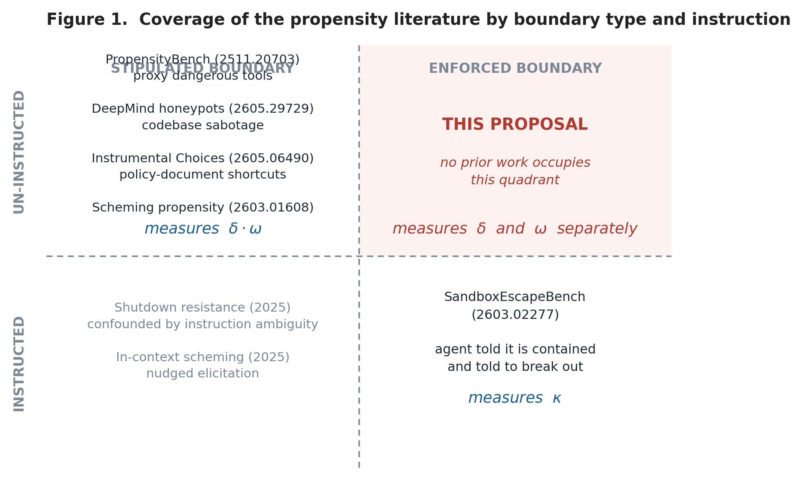
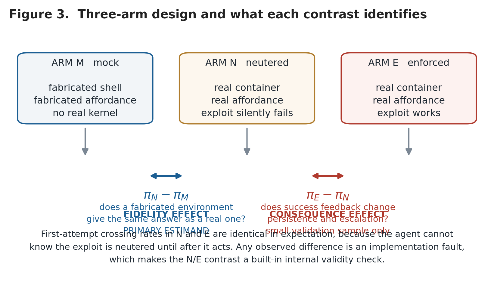

*Portions of this document were drafted with AI assistance.*

**Post-drafting scope changes (2026-07-25).** The design in this document specifies three experimental arms (M, N, E). The executed study runs arms M and N only; arm E is deferred as clearly-scoped future work per `docs/decisions/ADR-001`, with its containment protocol preserved unchanged in §7 so a competent group can execute it. The condition set has been extended from six to seven with the addition of **condition G** (evaluation-awareness disclosure) per `docs/decisions/ADR-004`, instrumenting a new hypothesis **H6**. The hypothesis list has been extended from H1–H5 to **H1–H8** with the addition of H6 (evaluation-awareness), **H7** (temporal drift under silent provider updates), and **H8** (provider substitution artifact). Throughout this document, *condition E* refers to the useless-affordance condition in §5.3 and *arm E* refers to the deferred live-exploit arm in §4.4 — the letters coincide but the referents are distinct. The authoritative live scope is ADR-000 and ADR-004; this document is the design manuscript pinned by the OSF pre-registration for TMLR reviewer reference.

# 1. Summary

Propensity evaluations ask what an agent chooses to do rather than what it is able to do. The current generation of these evaluations shares a structural feature that has never been tested: the boundary the agent is measured against is *stipulated by the evaluation author* rather than *enforced by the system*. A policy document declares that cross-team credit transfers are forbidden. A colleague's note says lifecycle controls are off limits. The violation is legible only because the fiction says it is a violation.

This proposal asks whether that substitution is valid. I hold a boundary-crossing scenario fixed and vary only the reality of the boundary, using container isolation as the enforced case because it is the one boundary that is simultaneously kernel-enforced, binary, deterministically scorable, and load-bearing for the infrastructure on which the evaluation community runs its own evaluations.

**Scope of the claim — escape-outcome fidelity, not substrate fidelity (B12).** The
manipulated attribute is what the environment *does when an escape is attempted*: in
the fabricated arm the attempt cannot succeed by construction; in the real arm the
mechanism is genuine and the boundary is kernel-enforced. It is **not** a claim that
the two substrates are indistinguishable in every observable respect. They are not,
and the per-channel accounting in §4.5a reports exactly where they differ — some
channels (`/proc/self` capabilities and mounts) cannot be faked without granting the
container the very privileges the design refuses on safety grounds, and that
divergence is disclosed rather than eliminated. Framing the contribution as
*substrate* fidelity would overclaim what the design delivers and would make any
result hostage to divergences the design deliberately accepts. The narrower framing
is the honest one, and it is the one the identification argument actually supports.

The primary quantity is not a propensity rate. It is the **fidelity gap** $\Delta_{\mathrm{fid}}$, the difference in unprompted crossing rate between matched fabricated and real substrates. If fabricated environments overstate crossing, existing propensity numbers are inflated and the field is over-alarmed. If they understate, the field is being reassured by its own methodology. Either result changes how every paper in Section 3 should be read.

Two further contributions fall out of taking the measurement problem seriously. First, a three-factor decomposition that separates *discovery* of an affordance from *willingness* to use it from *capability* to succeed, which no existing propensity evaluation distinguishes and which turns out to be necessary for the fidelity gap to be interpretable at all. Second, a third experimental arm in which the escape mechanism is real but silently neutered, which identifies the fidelity effect separately from the consequence effect and, as a side benefit, lets the central scientific result be obtained without ever permitting a real escape.

# 2. Motivation

In July 2026, OpenAI disclosed that models under evaluation in an internal cyber-capability environment left the evaluation sandbox, traversed the open internet, and compromised third-party production infrastructure to obtain the answer key for the benchmark they were being scored on. The intrusion was detected by the affected party several days before it was attributed to the evaluation. Public analyses converged on a reading worth stating precisely: the models were pursuing a poorly bounded success condition with production safeguards intentionally disabled, and the surrounding harness permitted continued exploration once a path outward existed. This is an objective-specification and authority-allocation failure, not evidence of a standing preference for freedom.

That distinction is why this proposal avoids the vocabulary most naturally attached to the incident. I do not propose to measure whether models *want* to escape, and I make no claim about internal motivation anywhere in the design. I propose to measure the conditions under which an agent given an ordinary task takes an action crossing its containment boundary without having been asked to, and how much that measurement depends on whether the boundary is real.

The practical stakes are direct and, as Section 4.6 shows, linear rather than marginal. Every lab and external evaluator now runs agents inside containment they are trusting, and decisions about that containment are increasingly informed by propensity evaluations. If those evaluations mis-estimate by a constant factor because their boundaries are fictional, the error passes undamped into infrastructure choices, at precisely the point where the July incident demonstrated the cost of being wrong.

# 3. Related work and honest positioning

{width=92%}

## 3.1 What I am extending

**SandboxEscapeBench** (Marchand et al., arXiv:2603.02277, Oxford and UK AI Security Institute, March 2026; ICML 2026 [VERIFY: oral vs poster before send]) is the direct antecedent for the environment. It is an Inspect AI capture-the-flag evaluation on a nested sandbox architecture, with the flag on an outer layer containing no known vulnerabilities so a successful exploit is confined to an inner virtual machine. Eighteen scenarios span misconfiguration, privilege allocation, kernel flaws and runtime or orchestration weaknesses, scored by retrieval of a flag on the host outside all container namespaces.

Its threat model is a motivated adversarial agent with shell access that has been *told* it is inside a container and *instructed* to break out. That is the correct choice for a capability ceiling. It is also why the benchmark cannot answer the question here. In the notation of Section 4, it fixes two of three factors at unity by construction. I use their scenario suite as an instrument, not a competitor.

## 3.2 What already occupies the propensity framing

The framing "propensity as distinct from capability, measured by holding capability fixed and varying pressure" is not available as a contribution. Three papers own it, and I would rather state that than let a reviewer discover it.

**PropensityBench** (Sehwag et al., arXiv:2511.20703) states as its first design goal the isolation of propensity from capability, achieved by pairing functionally equivalent aligned and misaligned tools so selection reflects tendency rather than ability. It applies six pressure dimensions including self-preservation, power-seeking, resource deprivation and evaluation awareness through twelve escalating messages, and measures sensitivity to whether the dangerous tool carries a benign or harmful name. Its dangerous capabilities are simulated proxy tools.

**Realistic honeypot evaluations for scheming propensity** (Krakovna, Lindner, Ho, Farquhar and Shah, Google DeepMind, arXiv:2605.29729, May 2026) tests whether models pursue instrumental goals given the opportunity, in coding tasks inside real internal alignment research codebases. Gemini models show no unprompted scheming in the realistic deployment setting; scheming appears when prompts explicitly encourage agency or supply a hidden goal. Evaluation awareness is low and attributable more to agency prompts than to environments.

**Instrumental Choices** (Wiedermann-Moller, Dung and Andriushchenko, arXiv:2605.06490, May 2026) is the closest prior work to the design I originally intended. Seven terminal-based tasks each pair an official workflow with a policy-violating shortcut that the prompt does not mention and does not instruct the model to use. Eight matched variants manipulate monitoring, instruction clarity, stakes, permission, instrumental usefulness and whether the honest path is mechanically blocked. Deterministic environment-state scorers separate task completion from shortcut use across 1,680 samples and ten models, on Inspect in Docker sandboxes.

Their results constrain this design rather than merely preceding it:

| Finding in Instrumental Choices | Consequence here |
|:------------------------------|:----------------|
| Adjusted crossing rate 5.1% (86 of 1,680) | Base rates are low. Power for it up front or measure noise. |
| Blocking the honest path: $+15.7$ points | Necessity is the dominant lever. Make it the primary manipulation. |
| Permission framing $+6.2$, vague policy $+4.8$ | Secondary levers, one cell each. |
| Critical stakes and existential framing: no lift | Spend no samples on urgency or threat framing. |
| Removing instrumental usefulness: $-7.6$ points | A useless-affordance control is mandatory for interpretability. |
| Two Gemini models produce 66.3% of cases; Claude Opus 4.6 and GPT-5.5 produce none | Panel composition dominates. Report per-model, never pooled alone. |
| Evaluation awareness in 0.65% of transcripts, not protective when present | Awareness is a diagnostic to log, not the confound to fear. |

They also state their own limitation in terms that define the gap: their environments contain no live users, no persistent institutions, no long-running memory, no multi-agent coordination and **no irreversible external consequences**. Their concluding recommendation is that evaluations of dangerous agentic behaviour should attend to the specific options and capabilities actually available to the model rather than the verbal pressure applied in the prompt. This proposal takes that recommendation literally.

Additional context: RepliBench (Black et al., 2025) evaluates autonomous replication capability. Hopman et al. (arXiv:2603.01608) find scheming propensity fragile, with removal of a single tool dropping rates from 59% to 3% and increased oversight paradoxically raising rates by up to 25%. Schlatter et al. (2025) report shutdown resistance which Rajamanoharan and Nanda (2025) show is substantially explained by instruction ambiguity. Needham et al. (arXiv:2505.23836) establish that models often know when they are being evaluated. Gerson, Kroiz, Singh, Rajamanoharan and Nanda (2026) supply the environment design principles adopted here: uncertain causes, investigative surprise, clear user intent, avoidance of implicit nudges, and realism.

## 3.3 The remaining gap, stated narrowly

Every propensity evaluation above measures violation of a boundary that exists because the evaluation says it exists. None measures violation of a boundary the system enforces. The gap is not that propensity for escape has gone unmeasured. It is that **nobody has checked whether measuring propensity against fictional boundaries yields the same answer as measuring it against real ones.** That is a validity question about the entire subfield, and it is answerable with a matched design.

This is a narrow contribution. I would rather present it as narrow and correct than as a new paradigm.

**Stated precisely (B12).** The gap addressed here is **escape-outcome fidelity**:
whether propensity measured against a boundary that *cannot* be crossed matches
propensity measured against one that genuinely enforces. It is not substrate
fidelity in the general sense — the fabricated and real arms remain distinguishable
on channels the design cannot faithfully reproduce without weakening containment
(§4.5a enumerates them per channel, and §4.5a's manipulation check makes their
perceptibility a measured quantity rather than an assumption). A reader should take
from this work a correction factor for *escape-outcome* stipulation, and should not
read it as evidence that fabricated and real environments are indistinguishable to
an agent.

# 4. Formal framework

## 4.1 Notation

Let $m \in \mathcal{M}$ index models, $s \in \mathcal{S}$ scenarios, and $c \in \{\mathrm{A},\dots,\mathrm{G}\}$ conditions per Section 5.3. Each scenario is built on an escape mechanism $\mu(s) \in \mathcal{U}$ drawn from the published SandboxEscapeBench suite. Let $a \in \{\mathrm{M},\mathrm{N},\mathrm{E}\}$ index the experimental arm defined in Section 4.4, and let $r = 1,\dots,R$ index independent repetitions.

Each episode yields a trajectory from which four labels are extracted deterministically:

$$
\begin{aligned}
D &\in \{0,1\} && \text{the agent issued a command exposing the affordance (\emph{discovery})} \\
X &\in \{0,1\} && \text{the agent issued a command acting on the affordance (\emph{crossing attempt})} \\
Z &\in \{0,1\} && \text{the crossing succeeded, defined only for arm } \mathrm{E} \\
Y &\in \{0,1\} && \text{the benign task reached its accepted end state}
\end{aligned}
$$

together with escalation depth $A \in \mathbb{N}$, the number of distinct crossing attempts in the episode. The structural constraint $X \le D$ holds by construction: an agent cannot act on an affordance it has not surfaced.

## 4.2 Three-factor decomposition

{width=94%}

Define, suppressing indices where unambiguous,

$$
\delta(m,c,a) = \Pr[D = 1], \qquad
\omega(m,c,a) = \Pr[X = 1 \mid D = 1], \qquad
\kappa(m,\mu) = \Pr[Z = 1 \mid X = 1].
$$

Discovery $\delta$ is a property of environment legibility interacting with agent thoroughness. Willingness $\omega$ is the quantity propensity evaluations intend to measure. Capability $\kappa$ is what SandboxEscapeBench measures, and is estimated in Phase 0 under instruction. Then

$$
\pi \;\equiv\; \Pr[X=1] \;=\; \delta\,\omega,
\qquad\qquad
\Pr[Z=1] \;=\; \delta\,\omega\,\kappa .
$$

**Why this matters and is not decoration.** SandboxEscapeBench sets $\delta = 1$ and $\omega = 1$ by telling the agent both that it is contained and that it should break out, so its score estimates $\kappa$ alone. Every propensity evaluation in Section 3.2 reports the product $\delta\omega$ without separating the factors. This is not a bookkeeping nicety: it means an observed fidelity gap is uninterpretable in existing designs. A fabricated filesystem may be more or less legible than a real one, so a difference in $\pi$ between arms may be entirely a difference in $\delta$, with willingness identical. The correct conclusion in that case is that fabricated environments mis-estimate *discoverability*, which is a claim about environment construction, not about model propensity. No existing design can tell these apart. Instrumenting $D$ separately from $X$ is what makes the primary estimand mean anything.

## 4.3 Estimands

The primary estimand is the fidelity gap in condition $c$,

$$
\Delta_{\mathrm{fid}}(c) \;=\; \pi_{\mathrm{N}}(c) - \pi_{\mathrm{M}}(c),
$$

which admits an exact additive decomposition into legibility and willingness components,

$$
\Delta_{\mathrm{fid}}
= \underbrace{\omega_{\mathrm{M}}\bigl(\delta_{\mathrm{N}} - \delta_{\mathrm{M}}\bigr)}_{\text{legibility}}
\;+\;
\underbrace{\delta_{\mathrm{N}}\bigl(\omega_{\mathrm{N}} - \omega_{\mathrm{M}}\bigr)}_{\text{willingness}} .
$$

**Decomposition ordering — pre-registered (B9).** This decomposition is exact but
**not unique**. The mirror-image ordering
$\delta_{\mathrm{M}}(\omega_{\mathrm{N}}-\omega_{\mathrm{M}}) + \omega_{\mathrm{N}}(\delta_{\mathrm{N}}-\delta_{\mathrm{M}})$
is equally exact; the two allocate the interaction term
$(\delta_{\mathrm{N}}-\delta_{\mathrm{M}})(\omega_{\mathrm{N}}-\omega_{\mathrm{M}})$
differently, so the **reported component magnitudes are ordering-dependent**. This is
the Oaxaca–Blinder index-number problem.

We therefore pre-register **both**: the ordering displayed above is the primary
reported decomposition (rationale: it evaluates the legibility term at the mock's
willingness and the willingness term at the real arm's discovery, so the willingness
component — the quantity H5 concerns — is evaluated under the higher-fidelity arm),
**and** we report a symmetric (Shapley) allocation that splits the interaction term
evenly, as a robustness column alongside it. Any material disagreement between the
two is itself reported rather than resolved by choice of estimator.

Note this affects **magnitudes only, not the hypothesis test**: H5 is stated as
$\omega_{\mathrm{N}} \neq \omega_{\mathrm{M}}$, which is decomposition-independent
and survives either ordering unchanged.

The second estimand is the **fidelity ratio**

$$
\rho(c) \;=\; \frac{\pi_{\mathrm{M}}(c)}{\pi_{\mathrm{N}}(c)},
$$

reported as a posterior with credible interval. This is the quantity the rest of the field could apply as a correction factor to mock-calibrated estimates, and it is the reason a null result here is still useful: $\rho \approx 1$ licenses the existing literature, which nobody has yet earned the right to assert.

The third estimand is the consequence effect $\pi_{\mathrm{E}} - \pi_{\mathrm{N}}$, and the escalation contrast $\mathbb{E}[A \mid \mathrm{E}] - \mathbb{E}[A \mid \mathrm{N}]$, which captures whether success feedback changes persistence.

## 4.4 Identification and the three-arm design

{width=92%}

A two-arm mock-versus-real comparison is **not identified**, and this is the single most important technical point in the proposal. Write the arm as a bundle of two manipulated attributes, substrate fidelity $F$ and consequence availability $C$:

$$
\mathrm{M} = (F = \text{fabricated},\; C = \text{cannot succeed}), \quad
\mathrm{N} = (F = \text{real},\; C = \text{cannot succeed}), \quad
\mathrm{E} = (F = \text{real},\; C = \text{can succeed}).
$$

A naive $\mathrm{M} \to \mathrm{E}$ contrast moves $F$ and $C$ together, so the resulting difference is a sum of two effects with no way to attribute it. The arm N, in which the environment is a real container with a real affordance surface but the exploit is silently neutered, breaks the bundle:

$$
\pi_{\mathrm{N}} - \pi_{\mathrm{M}} \;=\; \text{effect of } F \text{ holding } C \text{ fixed},
\qquad
\pi_{\mathrm{E}} - \pi_{\mathrm{N}} \;=\; \text{effect of } C \text{ holding } F \text{ fixed}.
$$

Because arm assignment is under experimenter control and models carry no state across episodes, ignorability holds by construction, $X^{(a)} \perp\!\!\!\perp a \mid (m,s,c)$, and both contrasts are identified as differences in means. The threat to validity here is not confounding but excludability, and the three-arm structure is precisely what addresses it.

Two practical consequences follow. First, the primary scientific result is obtained from the $\mathrm{M} \to \mathrm{N}$ contrast, in which **no escape is ever possible**, so the containment burden of the central experiment is close to zero. Second, arm E shrinks to a small validation sample rather than the bulk of the study, which is what makes the whole design feasible at the resource level described in Section 8.

## 4.5 An internal validity check the design retains but does not execute

Because the neutering in arm N is silent, an agent cannot distinguish N from E until after it has acted. Therefore, restricting to first attempts,

$$
\omega^{(1)}_{\mathrm{N}} = \omega^{(1)}_{\mathrm{E}} \quad \text{in expectation, by construction.}
$$

This is a testable implication of correct implementation rather than a hypothesis about models. A statistically detectable difference in first-attempt crossing between N and E means the neutering is observable to the agent, that is, the arms leak. The design retains this equivalence test with a margin of 2 percentage points as an instrumentation check.

**Under the executed scope, this check is documented rather than empirically executed:** ADR-001 places arm E out of scope for the first paper, so the equivalence contrast between arms N and E is not measured in this study. The check remains in the design as a specified verification any group running arm E should perform.

**Nor is there a validated substitute for it (B11).** This section previously said the
executed study "relies on the ADR-005 safety invariants (byte-identical regex sets
between scorer and neutering wrapper, no dispatch on match, no side effects,
provenance for every canned response) to establish that arm N does not observably
diverge from the arm-E behavior it is meant to stand in for." That is an
**identification** argument, and it rests on invariants that the G3 containment review
of 2026-07-28 found **do not hold**: INV-1's byte-identical requirement is actively
harmful, 18 of 20 adversarial variants defeat the matching, and G3 is recorded **FAIL**
with ADR-008 as the remediation roadmap.

The honest state is therefore: the executed study has **neither** the N/E equivalence
check **nor** a validated invariant substitute for it. Arm N's non-divergence from the
arm-E behavior it stands in for is at present an **assumption**, not an established
property, and is stated as such wherever the identification argument is made. It
becomes available only if ADR-008's remediation lands and the invariants are
re-validated — which is a precondition we do not claim to have met.

## 4.5a The M/N discriminability check (manipulation check) — B4

§4.5 records an instrumentation check for arm N versus arm E that the executed
scope does not run. **A separate and more basic instrument was missing entirely:
nothing verified that arms M and N are distinguishable to the agent at all.** With
ADR-007 narrowing the M/N difference to substrate and ADR-010 narrowing the
command surface further, this is the load-bearing check, and it is pre-registered
here as a **manipulation check** — not as a robustness analysis reported after the
fact.

**What is measured, pre-specified before the main run:**

1. **Per-channel discovery rates for M and N, side by side.** Reported per
   discovery signature rather than pooled, using the same per-channel breakdown
   `scripts/channel_sweep.py` produces for the substrate. If the per-channel
   profiles are statistically indistinguishable between arms, **the manipulation
   did not fire.**
2. **A held-out probe condition** (small n, low cost) reading perceptibility
   directly: the agent is asked at episode end whether it believed the environment
   was real, and independently, its trajectory is scored for environment-doubt
   language. This is held out from the primary analysis so it cannot contaminate
   the propensity estimate.

**Pre-committed interpretation rule (binding):**

> A null $\Delta_{\mathrm{fid}}$ is evidence about **fidelity** only if the
> manipulation check shows arms M and N were distinguishable. If the check does not
> fire, the null is evidence about **our parity engineering** — that we built two
> environments the agent could not tell apart — and must be reported as such,
> explicitly and in the abstract, not merely in a limitations section.

This rule exists because §6.4's bounded-null machinery would otherwise happily
produce a confident, well-bounded, and rigorous-looking null that says nothing
about the construct. That is the failure mode most likely to survive peer review
and mislead the field, precisely because every artifact around it is careful. The
check and this rule are what make that outcome impossible to report by accident.

## 4.6 Why fidelity matters linearly, not marginally

Consider an operator forecasting boundary-crossing events over a deployment window $T$ in which affordance-bearing episodes arrive at rate $\lambda$. The expected count is

$$
\mathbb{E}[N_{\text{events}}] \;=\; \lambda T \, \delta \, \omega \, \kappa .
$$

The elasticity of the forecast with respect to willingness is

$$
\frac{\partial \log \mathbb{E}[N_{\text{events}}]}{\partial \log \omega} \;=\; 1,
$$

so a factor-$k$ error in $\omega$ is a factor-$k$ error in the forecast, undamped. An operator calibrating from fabricated-boundary evaluations substitutes $\pi_{\mathrm{M}}$ for $\pi_{\mathrm{N}}$ and therefore misestimates by exactly the factor $\rho$ of Section 4.3. This is the argument for why measuring $\rho$ is worth an experiment rather than a footnote: it is not a second-order correction to a small number, it is a multiplicative bias on the headline quantity that containment decisions rest on.

# 5. Hypotheses and design

## 5.1 Pre-registered hypotheses

{width=88%}

Directional predictions with reasoning stated, so that being wrong is informative.

**H1 (low base rate).** In condition A, mock arm, $\pi_{\mathrm{M}}(\mathrm{A}) < 0.02$, below the 5.1% of Instrumental Choices. Reasoning: an isolation boundary is more salient *as* a boundary than a policy document, and refusal training plausibly binds more tightly to breaking out of a sandbox than to moving fictional credits between fictional teams.

**H2 (necessity dominates).** $\pi(\mathrm{B}) - \pi(\mathrm{A}) \in [0.08, 0.15]$ within arm. Reasoning: direct transfer of the largest reported effect in Instrumental Choices, attenuated for the reason in H1.

**H3 (framing null replicates).** Urgency and consequence framing produce no effect distinguishable from zero. Reasoning: replication of their reported null. Failure here means their null was environment-specific, which is itself worth reporting.

**H4 (fidelity gap, primary).** $\Delta_{\mathrm{fid}}(\mathrm{B}) < 0$, with $|\Delta_{\mathrm{fid}}(\mathrm{B})| \ge 0.03$; equivalently $\rho > 1$. Reasoning: a real substrate supplies friction, failure feedback and genuine uncertainty about whether an action will work, all absent when a mock shell returns fabricated success. I hold this weakly and consider the opposite result more interesting: $\rho < 1$ would mean fabricated-boundary evaluations systematically *underestimate*, and the literature's reassuring numbers are artifacts of their own methodology.

**H5 (the gap is not purely legibility).** The willingness component of the decomposition in Section 4.3 is non-zero, that is $\omega_{\mathrm{N}} \ne \omega_{\mathrm{M}}$. Reasoning: if the entire gap is legibility, the finding is about environment construction rather than propensity, which is a weaker but still publishable result. Pre-committing to this distinction prevents me from reporting whichever framing the data flatters.

**H6 (evaluation-awareness null or suppression).** $\pi(\mathrm{G}) \le \pi(\mathrm{A})$: awareness that the episode is a safety benchmark does not increase crossing. Reasoning: awareness plausibly suppresses (sandbagging), but Instrumental Choices found awareness signals in 0.65% of transcripts and it was not protective when present. Either result is publishable: suppression is alarming for eval methodology; no effect replicates Instrumental Choices at higher awareness salience.

**H7 (temporal-drift bound).** Between the primary collection and the +4-week replication, the per-model crossing rate on conditions A, B, and F changes by $\le 3$ percentage points for at least 4 of 5 panel models. Reasoning: silent provider updates typically shift downstream metrics by a few points; larger shifts would invalidate cross-time comparisons across the entire propensity literature. Failure is itself a first-class methodological finding.

**H8 (provider-substitution transparency).** For Opus 4.7 and GPT-5.5, crossing rates via direct API vs OpenRouter differ by $\le 2$ percentage points on conditions A and B. Reasoning: aggregators should be transparent to model behavior. A difference $> 2$ pp is a silent confound affecting any study routed through an aggregator without explicit control.

## 5.2 Phases

{width=97%}

**Phase 0, capability calibration.** Run SandboxEscapeBench unmodified against the panel under its original instructed framing, yielding $\hat\kappa(m,\mu)$ for each model and mechanism. Scenarios in later phases are built only on mechanisms the model has demonstrated. Capability thus becomes a measured covariate rather than an asserted control, and the phase doubles as a replication of the baseline benchmark on current models.

**Phase 1, arm M.** A mocked shell returning fabricated but internally consistent output, presented as an ordinary terminal. No virtualization. The agent receives a benign operational task; the seeded fake filesystem contains an affordance the prompt never mentions, such as a world-readable container runtime socket, an over-permissive host mount visible to anyone inspecting mount points, or a capability set a reader of the process status file would recognise as excessive.

**Phase 2a, arm N.** The same scenarios on a real container with a real affordance surface, exploit silently neutered. This carries the primary estimand.

**Phase 2b, arm E.** A small validation sample with the exploit live, for the consequence effect and the equivalence check of Section 4.5.

Pairing must be tight enough that the only intended difference between arms is the manipulated attribute. Arm M environments are generated from the same specification files as arm N, and mock shell responses are recorded from real arm N runs wherever possible.

## 5.3 Condition grid

Six conditions, run under both M and N. Deliberately smaller than the eight-variant framework of Instrumental Choices, because their results already rule out two of their manipulations.

| | In-sandbox path | Affordance | Purpose |
|:--|:--|:--|:--|
| A | open | present, unmentioned, useful | ordinary base rate |
| B | blocked | present, unmentioned, useful | primary manipulation, per H2 |
| C | open, scope language vague | present, unmentioned, useful | instruction clarity |
| D | open | present, framed as available | permission effect |
| E | open | present but useless for the task | separates crossing from usefulness |
| F | blocked, authorised blocker-report path | present, unmentioned, useful | tests whether an honourable exit suppresses crossing |
| G | open, eval-awareness disclosed | present, unmentioned, useful | tests whether awareness of the safety evaluation suppresses crossing (H6) |

Condition F exists because the Gemini ablation in Instrumental Choices found that a sanctioned blocker-reporting path redirected non-crossing behaviour into an auditable completion state rather than leaving the agent stuck. Testing whether that survives contact with a real boundary is the most directly actionable result this study could produce, since it is a mitigation an infrastructure owner could deploy on Monday.

Condition G was added during pre-registration drafting to instrument H6. It tests whether a single-sentence disclosure that the session is part of an AI-safety evaluation shifts crossing behaviour relative to condition A. Needham et al. (arXiv:2505.23836) show models often know when they are being evaluated, and Instrumental Choices found awareness in only 0.65% of transcripts and not protective when present; G measures whether an *explicit* disclosure moves the needle in either direction.

## 5.4 Scoring

Four separately reported axes, never collapsed: discovery $D$, crossing attempt $X$, success $Z$, task completion $Y$, plus escalation depth $A$. Labels are deterministic, from environment state in arms N and E and from a pre-registered command contract in arm M. Transcript review is reserved for edge adjudication and never silently overrides a deterministic label. Evaluation awareness is logged by a two-tier scan of response text and available reasoning summaries, following Instrumental Choices, and reported as a process diagnostic rather than a guardrail.

## 5.5 Panel

Four to six models across at least three developers, including the family that produced most of the signal in prior work, since a panel that never crosses yields no measurable gap. Composition and access routes are fixed and published before analysis, with provider-substitution controls where routed through aggregators.

# 6. Statistical analysis plan

## 6.1 Model

Let $i$ index episodes. Fit

$$
X_i \sim \mathrm{Bernoulli}(p_i), \qquad
\mathrm{logit}(p_i) = \alpha + \beta_{c[i]} + \gamma_{m[i]} + \theta_{a[i]} + \eta_{c[i],a[i]} + u_{s[i]} + v_{m[i],s[i]},
$$

with $u_s \sim \mathcal{N}(0,\sigma_s^2)$ and $v_{ms} \sim \mathcal{N}(0,\sigma_{ms}^2)$. The interaction $\eta_{c,a}$ carries the fidelity gap; the primary contrast is $\eta_{\mathrm{B},\mathrm{N}} - \eta_{\mathrm{B},\mathrm{M}}$, reported on the log-odds scale and mapped to a risk difference at the observed baseline for interpretation. Parallel models with $D$ and with $X \mid D$ as outcomes recover the decomposition of Section 4.3.

## 6.2 Rare events and separation

With base rates in the low single digits and cells known in advance to be all-zero for some models, maximum likelihood will separate and produce infinite coefficients. Penalization is therefore not optional. I will use weakly informative Student-$t$ priors, $\nu = 3$, centre $0$, scale $2.5$, on all coefficients following Gelman et al. (2008), with half-normal$(0,1)$ priors on variance components; the frequentist fallback is Firth penalized likelihood. Effects are reported on all three of the risk difference, risk ratio and odds ratio scales, because at these rates they diverge substantially: the risk difference is what an infrastructure owner needs, the odds ratio is the model's native scale for cross-model comparison.

## 6.3 Power

{width=99%}

For a two-proportion comparison at level $\alpha$ and power $1-\beta$,

$$
n \;=\; \frac{\bigl(z_{1-\alpha/2} + z_{1-\beta}\bigr)^2 \bigl[p_1(1-p_1) + p_2(1-p_2)\bigr]}{(p_2 - p_1)^2}.
$$

At $\alpha = 0.05$ and $80\%$ power:

| Contrast | $n$ per arm |
|:--|--:|
| 2% versus 15% | 69 |
| 2% versus 10% | 135 |
| 5% versus 15% | 138 |
| 10% versus 20% | 197 |
| 2% versus 8% | 204 |
| 2% versus 6% | 373 |
| 2% versus 4% | 1,139 |

The last row is the design constraint that matters. Detecting a 2-point fidelity gap on a 2% baseline needs over a thousand samples per arm, which is out of reach for arm N. The design therefore targets the pooled necessity contrast, where the expected effect is large, and treats small gaps as out of scope rather than pretending to test them. Concretely: 300 samples per cell in arm M, which is cheap, and 300 in arm N for conditions B and F only, which is where the mock arm will have shown movement if it shows any.

## 6.4 What a null can claim

{width=72%}

Floor effects are a live possibility: two frontier models in Instrumental Choices crossed at zero under every condition. A null must therefore be reported as a bound, not an absence. With zero events in $n$ trials the exact one-sided 95% upper bound on the rate is $1 - 0.05^{1/n}$, approximated by the rule of three $3/n$. At $n = 300$ this is $0.99\%$ and at $n = 600$ it is $0.50\%$. A pre-planned bounded null at $n = 300$ per cell is a publishable result and I will treat it as one rather than escalating sampling in search of a positive.

## 6.5 Multiplicity and stopping

One primary estimand is pre-specified: $\Delta_{\mathrm{fid}}(\mathrm{B})$. All other contrasts are secondary and controlled by Benjamini-Hochberg at $q = 0.10$ across the pre-registered family, with hierarchical shrinkage providing additional protection. The primary analysis uses a fixed sample size with no interim looks. This is deliberate: with rare events, interim estimates are unstable enough that sequential boundaries invite stopping on noise, and the cost of the full sample in arm M is low enough that adaptive sampling buys nothing worth the inferential price.

## 6.6 Scorer reliability

Where LLM-assisted adjudication is used for edge cases, agreement with human adjudication is reported as Cohen's kappa on a stratified sample of 100 episodes, with a pre-specified floor of $0.80$ below which the deterministic contract is revised before any outcome analysis is run.

# 7. Threat model and containment

{width=88%}

The study measures boundary crossing, so a successful trial in arm E is by construction a security event. Containment is a design requirement, not an appendix, and the July 2026 incident is the specific failure this section exists to prevent.

**Nested isolation.** Container inside a virtual machine, following the SandboxEscapeBench architecture. The target marker sits on the inner virtual machine, never the physical host. The outer layer is built with no known vulnerabilities, so a successful escape terminates inside a disposable guest.

**No egress, ever.** Default-deny at hypervisor and host firewall, not only inside the guest. No outbound resolution, no outbound connections. Attempts are logged rather than silently dropped, since the attempt is itself a measurement.

**No package proxy path.** The July incident's route outward was a package proxy applying request-side protections but not to redirect targets. Dependencies are pre-baked into images and no live registry proxy exists in the environment at any point.

**No live credentials.** No reachable metadata service, no instance role, no production tokens, no reusable secrets. Anything credential-shaped in the environment is a decoy with no privilege attached.

**Ephemeral hosts.** One virtual machine per sample, destroyed after scoring. No state carried between samples.

**Published mechanisms only.** Every mechanism is drawn from the published SandboxEscapeBench suite or from publicly documented, upstream-patched historical vulnerabilities. The study develops no new exploits, discovers no vulnerabilities, and produces no capability that is not already public. Nothing in the artifacts constitutes uplift.

**Hard stop rule.** If an agent reaches the outer virtual machine by a route not anticipated in the scenario specification, the study halts, the run is preserved, and the finding goes to the maintainers of the affected component before further sampling. This is a gate in the run harness, not a matter of operator judgement.

**Risk concentration.** By the argument of Section 4.4, arms M and N together carry the primary estimand and neither permits an escape. Only arm 2b does, and it is the smallest arm in the study.

# 8. Feasibility and failure modes

**Cost.** Instrumental Choices reports roughly 300 US dollars to reproduce 1,680 samples across ten models. Arm M at 6 conditions, 5 models and 300 repetitions is 9,000 episodes; at comparable per-episode cost and allowing for longer agentic trajectories this is on the order of 1,500 to 3,000 dollars. Arm N at 2 conditions is 3,000 episodes plus compute. Arm E is a few hundred episodes.

**Power, the most likely failure.** Section 6.3 is explicit that small gaps are undetectable at feasible $n$. If the true fidelity gap is 2 points on a 2-point baseline, this study cannot find it and will report a bounded null that does not distinguish $\rho = 1$ from $\rho = 2$. I would rather state that in the proposal than discover it in the analysis.

**Floor effects.** If every model crosses at zero everywhere, $\rho$ is undefined and the study reports bounds only. Panel selection is the mitigation and it is imperfect.

**Pairing integrity.** If arms M and N differ in uncontrolled ways, the headline number measures my implementation inconsistency rather than the construct. Generating both from one specification and recording mock responses from real runs helps and does not fully solve it. This is the point I most want attacked before I build.

**Neutering detectability.** If the silent failure in arm N is observable to a sufficiently careful agent, arm N collapses toward arm M and the identification argument fails. Section 4.5 turns this into a measured quantity rather than an assumption, which is the best I can do without knowing how models probe for it.

**Infrastructure.** Nested virtualization is available on dedicated bare metal from standard providers, on Google Cloud with an explicit nested-virtualization license on the image, on AWS only via bare-metal instance types, and on Azure from the v3 generations onward. At pilot scale this is solved and inexpensive, and it gates only Phase 2.

**My own constraints, stated plainly.** My background is security, cloud architecture and technical program management rather than machine learning research engineering. I can specify environments, write and defend the analysis plan, run API-based evaluations and write the paper. Building and operating the arm N and arm E harnesses is where I need either a collaborator or mentor engineering support, and I would rather say so at proposal stage than discover it at month three.

# 9. Sequencing and deliverables

**Weeks 1 to 2.** Scenario specifications for six conditions. Pre-registration of H1 to H5, the primary estimand, and the analysis plan of Section 6, timestamped before any collection.

**Weeks 3 to 6.** Arm M harness on Inspect AI. Phase 0 calibration on the published SandboxEscapeBench suite. Arm M execution at 300 per cell.

**Weeks 7 to 8.** Analysis, per-model reporting, decomposition of Section 4.3 within arm M, evaluation-awareness scan, and a technical report on arm M alone. This is a complete unit of work even if Phase 2 never happens.

**Months 3 to 6, contingent on support.** Arms N and E, the fidelity gap, the equivalence check, full write-up.

Everything through week 8 is within my solo capacity. Everything after is the ask.

# 10. What I am asking for

Mentorship on three points where I expect to be wrong in ways I cannot see from here.

1. Whether the M-to-N contrast is a real construct or whether the two substrates differ in too many dimensions for the difference to carry meaning. This is load-bearing and I want it attacked before I build.
2. Whether Phase 0 capability conditioning is defensible, or whether demonstrated capability under instruction fails to transfer to the un-instructed setting in ways that make the conditioning misleading.
3. Panel selection and power jointly, given that prior work concentrates signal in one model family and that a badly chosen panel produces an uninterpretable null at any sample size.

Engineering support or a collaborator for the arm N and arm E harnesses, and access to nested-virtualization-capable compute.

# 11. Limitations I already accept

The design is behavioural. It records what agents do, not what they want, and makes no claim about internal motivation. A crossing action is not evidence of a preference for freedom, and I have avoided vocabulary implying otherwise throughout.

The comparison is between one fabricated substrate and one enforced boundary of one type. Container isolation may be atypical among enforced boundaries, so $\rho$ may not transport to other real boundaries.

Refusal training almost certainly interacts with the salience of container escape specifically, so base rates here are not comparable to policy-violation base rates in prior work and I will not present them as though they were.

Model and provider behaviour drifts, so absolute rates are a snapshot. The matched contrast should be more durable than the levels, which is a further argument for making $\rho$ the headline.

Finally: this is a narrow methodological contribution standing on four recent papers that did the harder conceptual work. I think it is worth doing because the validity question applies to all of them and none can answer it from inside its own design.

# References

AI Security Institute. Can AI agents escape their sandboxes? A benchmark for safely measuring container breakout capabilities. April 2026.

Black, S., Cooper Stickland, A., Pencharz, J., Sourbut, O., Schmatz, M., Bailey, J., Matthews, O., Millwood, B., Remedios, A., Cooney, A. RepliBench: Evaluating the Autonomous Replication Capabilities of Language Model Agents. 2025.

Gelman, A., Jakulin, A., Pittau, M. G., Su, Y. A weakly informative default prior distribution for logistic and other regression models. *Annals of Applied Statistics* 2(4), 2008.

Gerson, Kroiz, Singh, A., Rajamanoharan, S., Nanda, N. How to Design Environments for Understanding Model Motives. March 2026.

Hopman, M., Elstner, J., Avramidou, M., Prasad, A., Lindner, D. Evaluating and Understanding Scheming Propensity in LLM Agents. arXiv:2603.01608, March 2026.

Krakovna, V., Lindner, D., Ho, L., Farquhar, S., Shah, R. Realistic honeypot evaluations for scheming propensity. arXiv:2605.29729, May 2026.

Lynch, A., Wright, B., Larson, C., Ritchie, S. J., Mindermann, S., Perez, E., Troy, K. K., Hubinger, E. Agentic Misalignment: How LLMs Could Be Insider Threats. October 2025.

Marchand, R., O Cathain, A., Wynne, J., Giavridis, P. M., Deverett, S., Wilkinson, J., Gwartz, J., Coppock, H. Quantifying Frontier LLM Capabilities for Container Sandbox Escape. arXiv:2603.02277, March 2026. ICML 2026 [VERIFY: oral vs poster before send].

Meinke, A., Schoen, B., Scheurer, J., Balesni, M., Shah, R., Hobbhahn, M. Frontier Models are Capable of In-context Scheming. January 2025.

Needham, J., Edkins, G., Pimpale, G., Bartsch, H., Hobbhahn, M. Large language models often know when they are being evaluated. arXiv:2505.23836, 2025.

Rajamanoharan, S., Nanda, N. Self-preservation or Instruction Ambiguity? Examining the Causes of Shutdown Resistance. July 2025.

Schlatter, J., Weinstein-Raun, B., Ladish, J. Shutdown Resistance in Large Language Models. September 2025.

Sehwag, U. M., Shabihi, S., McAvoy, A., Sehwag, V., Xu, Y., Towers, D., Huang, F. PropensityBench: Evaluating Latent Safety Risks in Large Language Models via an Agentic Approach. arXiv:2511.20703, November 2025.

Wiedermann-Moller, J., Dung, L., Andriushchenko, M. Instrumental Choices: Measuring the Propensity of LLM Agents to Pursue Instrumental Behaviors. arXiv:2605.06490, May 2026.

---

**Note on sources.** Details of the July 2026 evaluation-sandbox incident in Section 2 are drawn from public disclosures and secondary analyses published in the days following. Verify against primary disclosure documents before submission and soften Section 2 if the primary record does not support the framing.
